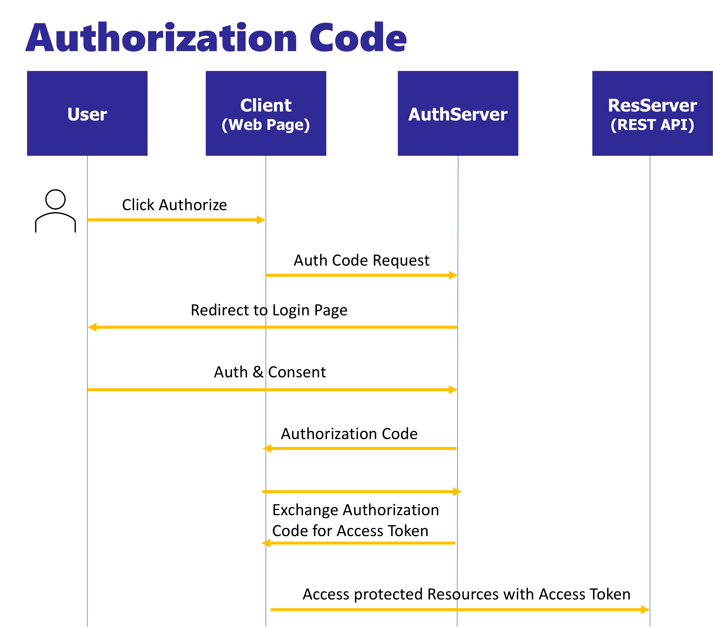

Using OAuth2 framework in InterSystems IRIS. Learn how to act as Client, Authentication Server or Resource Server.

# Setup
## Modify your local hosts file 
Add a line to resolve `webserver` to 127.0.0.1
```
127.0.0.1 webserver
```

You can find your hosts file in:
| O.S. | File |
| --------- | ----------- |
| MacOS | `/private/etc/hosts` |
| Windows | `c:\Windows\System32\Drivers\etc\hosts` |

## Certificate
* There is already a self-signed certificate generated in webserver/ssl-cert.pem, webserver/ssl-cert.key.
* You can use this certificate for test purposes.
* You will need to allow this certificate when navigating using a Web Browser (Safari, Chrome, etc.)

The certificate has been generated using:
```
openssl req -x509 -newkey rsa:4096 -keyout ssl-cert.key -out ssl-cert.pem -nodes -sha256 -days 999 -subj "/CN=webserver"
```

# Run
Build images:
```
docker-compose build
```

Run containers:
```
docker-compose up -d
```


# Overview

You will set up some examples using OAuth2 authorization framework and InterSystems IRIS.

In this examples, you will learn how InterSystems IRIS can act as different roles in the OAuth2 framework.

After running containers, you should get access to:
| Container  | Mng. Portal URL                                    | Notes                                                |
| ---------  | -----------                                        | -----------                                          |
| webserver  | https://webserver/csp/bin/Systems/Module.cxw       | HTTPS access to all IRIS instances                   |
| authserver | https://webserver/authserver/csp/sys/UtilHome.csp  | IRIS instance that will act as Authorization Server  |
| resserver  | https://webserver/resserver/csp/sys/UtilHome.csp   | IRIS instance that will act as Resource Server       |
| client     | https://webserver/client/csp/sys/UtilHome.csp      | IRIS instance that will act as Client                |

## Roles
* Resource owner — Usually a user.
* Resource server — A server that hosts protected data and/or services.
* Client — An application that requests limited access to a resource server. This can be a client-server application or can be an application that has no server (such as a JavaScript application or mobile application).
* Authorization server — A server that is responsible for issuing access tokens, with which the client can access the resource server. This server can be the same application as the authorization server but can also be a different application.

## Grant types and flows
A grant type specifies how the authorization server should process the request for authorization. The client specifies the grant type within the initial request to the authorization server.

You can find more information in the [documentation](https://docs.intersystems.com/iris20212/csp/docbook/Doc.View.cls?KEY=GOAUTH_background).

# (a) Authorization Code Example



## (a.1) AuthServer
You need to create an OAuth server definition in [AuthServer](https://webserver/authserver/csp/sys/UtilHome.csp). It can be done using the management portal or using `OAuth2.*` classes.

For convenience, you will use an [utility](oauth-auth-server/src/auth/server/Utils.cls) that is already prepared with some settings. 

Open a terminal session:
```
docker exec -it authserver bash
iris session iris
```

Create the OAuth server definition with the utility which uses `OAuth2.*` classes:
```
zn "AUTHSERVER"
do ##class(auth.server.Utils).CreateServerConfig()
```

* Have a look at the OAuth Server definition in *System Administration > Security > OAuth 2.0 > Server*
* After defining the server, a new `/oauth2` web application has been created.
* The OpenID URL for the server is available at: https://webserver/authserver/oauth2/.well-known/openid-configuration

## (a.2) Client
Now, you will create client definition in the [Client](https://webserver/client/csp/sys/UtilHome.csp) instance.

Create a dynamic OAuth server definition. This will be a reference to the authentication server you created in the previous step:
* Go to *System Administration > Security > OAuth 2.0 > Client > Client Configurations > Create Client Configuration*
* Issuer endpoint: `https://webserver/authserver/oauth2`
* SSL/TLS configuration: `ssl`

Create an OAuth client definition. This definition describes and registers a client that will use the authorization server: 
* Application name: `client-app`
* Client name: `client-name`
* Client type: `Confidential`
* SSL/TLS configuration: `ssl`
* Client redirect URL:
  * Use TLS: `yes`
  * Hostname: `webserver`
  * Prefix: `client`

## (a.3) Resource Server
Finally, you will create the resource server in the [ResServer](https://webserver/resserver/csp/sys/UtilHome.csp) instance:

Create a dynamic OAuth server definition. This also is a reference to the authentication server created before:
* Go to *System Administration > Security > OAuth 2.0 > Client > Client Configurations > Create Client Configuration*
* Issuer endpoint: `https://webserver/authserver/oauth2`
* SSL/TLS configuration: `ssl`

Create an OAuth client definiton. This client definition represents the resource server:
* Application name: `resserver`
* Client type: `Resource Server`
* SSL/TLS configuration: `ssl`

## (a.4) Test

### Client Application
* In the [Client](https://webserver/client/csp/sys/UtilHome.csp) instance you have already a simple web app created that uses the `%OAuth2` classes.
* Have a look at the code of [client.Application](oauth-client/src/client/Application.cls)
* Test the application using https://webserver/client/application/

### Resource Server
* In the [ResServer](https://webserver/resserver/csp/sys/UtilHome.csp) instance, you also have the resource server prepared.
* Check [res.Server](oauth-resource-server/src/res/Server.cls) source code.
* Resource server can be accessed only through the client application (otherwise it will return an error). 
* The protected resource URL is: https://webserver/resserver/protected-resources/
