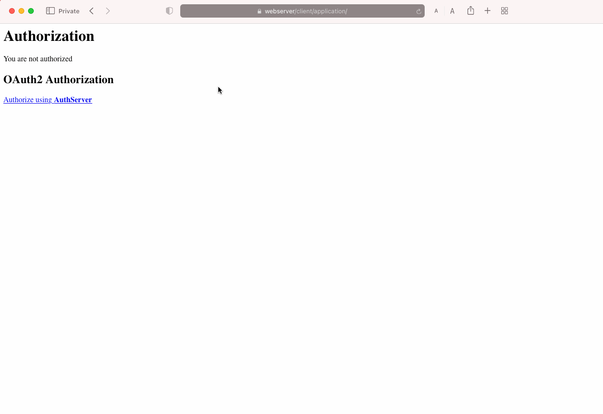

Using OAuth2 framework in InterSystems IRIS. Learn how to act as Client, Authentication Server or Resource Server in different scenarios.

# Setup
## Modify your local hosts file 
Add a line to resolve `webserver` to 127.0.0.1
```
127.0.0.1 webserver
```

You can find your hosts file in:
| O.S. | File |
| --------- | ----------- |
| MacOS | `/private/etc/hosts` |
| Windows | `c:\Windows\System32\Drivers\etc\hosts` |

## Certificate
* There is already a self-signed certificate generated in webserver/ssl-cert.pem, webserver/ssl-cert.key.
* You can use this certificate for test purposes.
* You will need to allow this certificate when navigating using a Web Browser (Safari, Chrome, etc.)

The certificate has been generated using:
```
openssl req -x509 -newkey rsa:4096 -keyout ssl-cert.key -out ssl-cert.pem -nodes -sha256 -days 999 -subj "/CN=webserver"
```

# Run
Build images:
```
docker-compose build
```

Run containers:
```
docker-compose up -d
```


# Overview

You will set up some examples using OAuth2 authorization framework and InterSystems IRIS.

In this examples, you will learn how InterSystems IRIS can act as different roles in the OAuth2 framework.

After running containers, you should get access to:
| Container       | URL                                                | Notes                                                |
| ---------       | -----------                                        | -----------                                          |
| webserver       | https://webserver/csp/bin/Systems/Module.cxw       | HTTPS access to all IRIS instances                   |
| authserver      | https://webserver/authserver/csp/sys/UtilHome.csp  | IRIS instance that will act as Authorization Server  |
| resserver       | https://webserver/resserver/csp/sys/UtilHome.csp   | IRIS instance that will act as Resource Server       |
| client          | https://webserver/client/csp/sys/UtilHome.csp      | IRIS instance that will act as Client                |
| angular-client  | http://localhost:8080/                             | Angular application that will act as Client          |

You can login in InterSystems IRIS instances using `superuser`/`SYS`.

## Roles
* Resource owner — Usually a user.
* Resource server — A server that hosts protected data and/or services.
* Client — An application that requests limited access to a resource server. This can be a client-server application or can be an application that has no server (such as a JavaScript application or mobile application).
* Authorization server — A server that is responsible for issuing access tokens, with which the client can access the resource server. This server can be the same application as the authorization server but can also be a different application.

## Grant types and flows
A grant type specifies how the authorization server should process the request for authorization. The client specifies the grant type within the initial request to the authorization server.

You can find more information in the [documentation](https://docs.intersystems.com/iris20212/csp/docbook/Doc.View.cls?KEY=GOAUTH_background).

## Scopes
Scopes are a mechanism in OAuth 2.0 to limit access. 

A client can request one or more scopes, this information is displayed to the user in the consent screen. Finally, the access token issued to the application will be limited to the scopes granted.

## OAuth and OpenID Connect
**Authentication** is the process of verifying that users are who they say they are. 

**Authorization** is the process of giving those users permission to access resources.

OAuth is an authorization framework. OAuth specifies `access tokens`, used when an app has been authorized.

OpenID Connect (OIDC) is extension to OAuth 2.0 to handle authentication. To request authentication, the client includes the `openid` scope value in the request to the authorization server. 

OIDC specifies `IDTokens`, used when a user has been authenticated.

There are some OIDC specific scopes:
| Scope     | Description                                                                           |    
| --------- | ---------                                                                             | 
| openid    | Returns sub (uniquely identifies the user), iss, aud, exp, iat, and at_hash claims    |
| profile   | Profile information like including name, family_name, given_name                      |
| email     | email claim                                                                           |  


# Scenario: REST API

In this scenario, you will secure a REST API (protected resource) that will be accessed from a registered client (Postman).

You will use **Client Credentials** OAuth grant type.


## Authorization Server
You need to create an OAuth server definition in [AuthServer](https://webserver/authserver/csp/sys/UtilHome.csp). It can be done using the management portal or using `OAuth2.*` classes.

For convenience, you will use an [utility](oauth-auth-server/src/auth/server/Utils.cls) that is already prepared with some settings. 

Open a terminal session:
```
docker exec -it authserver bash
iris session iris
```

Create the OAuth server definition with the utility which uses `OAuth2.*` classes:
```objectscript
zn "AUTHSERVER"
do ##class(auth.server.Utils).CreateServerConfig()
```

Have a look at the OAuth Server definition in [System Administration > Security > OAuth 2.0 > Server](https://webserver/authserver/csp/sys/sec/%25CSP.UI.Portal.OAuth2.Server.Configuration.zen) and check:

### Supported grant types
* These are the grant types that your auth server will support.
* There are different grant types suitable for different scenarios. For example, for a REST API you could use *client credentials*, and for web applications the *authorization code*.

### Scopes
* A client can request one or more scopes. This information is displayed to the user in the consent screen.
* You can define your own scopes.
* Your auth server will also support OIDC scopes.

### JWT Settings
* Algorithms used to sign and encrypt access token (JSON Web Token - JWT).

### Customization
* You can customize the behaviour of your auth server.
* In this case, customizations will be done in `AUTHSERVER` namespace.
* [auth.server.Authenticate](oauth-auth-server/src/auth/server/Authenticate.cls) can customize different methods like:
  * `BeforeAuthenticate`, `AfterAuthenticate`
  * `DisplayLogin` - customize login page that will be presented to users when authenticating
  * `DisplayPermissions` - customize consent page that will presented to users when consenting scopes
* [auth.server.Validate](oauth-auth-server/src/auth/server/Validate.cls) also can customize methods like:
  * `ValidateUser` - this is actually how users are authenticated in the system. By default it authenticates based on users created on the InterSystems IRIS instance. However you can write any other behaviour you need.  

After defining the server, a new `/oauth2` web application has been created.
The OpenID URL for the server is available at: https://webserver/authserver/oauth2/.well-known/openid-configuration

## Resource Server

### REST API
* There is a REST API implemented in [res.Server](oauth-resource-server/src/res/Server.cls)
* Check the source code. REST API will receive a token and it must validate that token.
* A web application [/protected-resources](https://webserver/resserver/csp/sys/sec/%25CSP.UI.Portal.Applications.Web.zen?PID=%2Fprotected-resources) defines the access to the REST API.
* The protected resource URL is: https://webserver/resserver/protected-resources/

### Secure REST API
The REST API will be an OAuth resource server in the [ResServer](https://webserver/resserver/csp/sys/UtilHome.csp) instance. 

Create a dynamic OAuth server definition. This also is a reference to the authentication server created before:
* Go to *System Administration > Security > OAuth 2.0 > Client > Client Configurations > Create Client Configuration*
* Issuer endpoint: `https://webserver/authserver/oauth2`
* SSL/TLS configuration: `ssl`

Create an OAuth client definiton. This client definition represents the resource server:
* Application name: `resserver`
* Client name: `resserver`
* Client type: `Resource Server`
* SSL/TLS configuration: `ssl`

### Delegated authentication in the REST API
* You can use delegated authentication in IRIS to control exactly the username and roles of the code executing in your REST API.
* The REST API is also accesible using [/protected-resources-delegated](https://webserver/resserver/csp/sys/sec/%25CSP.UI.Portal.Applications.Web.zen?PID=%2Fprotected-resources-delegated) to leverage delegated authentication.
* It uses [ZAUTHENTICATE.mac](oauth-resource-server/src/ZAUTHENTICATE.mac) routine to validate OAuth token and create delegated IRIS users that will run your code.
* You can find more information about that in the documentation.

### Client
You have now to register the client that will be able to ask for tokens and access the resource server.

* In [AuthServer](https://webserver/authserver/csp/sys/UtilHome.csp), go to *System Administration > Security > OAuth 2.0 > Server > Client Descriptions*
* Create a client description for our Postman client as follows.
* In the **Client Credentials** tab, copy `Client ID` and `Client Secret` values. You will use these values in Postman.


### Test

In Postman, do the following:
* Import [IRISOAuth2.postman_collection.json](./IRISOAuth2.postman_collection.json) in Postman.
* Test the **Access Protected Resources using Client Credentials** request.
* In the *Authorization* tab of the request, copy the values of `Client ID` and `Client Secret`.
* After that, get a new token and then access the protected resources:


# Scenario: simple web page
In this scenario you will secure a simple web page (in IRIS) that will allow different users to access protected resources. 

You will use **Authorization Code** OAuth grant type.


## Authorization Server
We will use the same configuration as in the previous scenario.
Have a look at the Authorization Server definition in [System Administration > Security > OAuth 2.0 > Server](https://webserver/authserver/csp/sys/sec/%25CSP.UI.Portal.OAuth2.Server.Configuration.zen).

## Resource Server
We will also use the same resource server configuration as in the previous scenario.

## Client

### Simple Web Page
* There is a simple web page implemented in IRIS [Client](https://webserver/client/csp/sys/UtilHome.csp) instance.
* Check the source code at [client.Application](oauth-client/src/client/SimpleWebPage.cls)
* This simple web page handle user authorization, displays info about authorization and uses the access token to access protected resources from resource server.
* This web application is controlled by the web application definition in [/application](https://webserver/client/csp/sys/sec/%25CSP.UI.Portal.Applications.Web.zen?PID=%2Fapplication)

### Secure Simple Web Page
You have to create client definition in the [Client](https://webserver/client/csp/sys/UtilHome.csp) instance to register the simple web application that will act as client.

Create a dynamic OAuth server definition:
* Go to *System Administration > Security > OAuth 2.0 > Client > Client Configurations > Create Client Configuration*
* Issuer endpoint: `https://webserver/authserver/oauth2`
* SSL/TLS configuration: `ssl`

Create an OAuth client definition. This definition describes and registers a client that will use the authorization server: 
* Application name: `simple-web-page`
* Client name: `simple-web-page`
* Client type: `Confidential`
* SSL/TLS configuration: `ssl`
* Client redirect URL:
  * Use TLS: `yes`
  * Hostname: `webserver`
  * Prefix: `client`
* Click on *Dynamic Registration and Save*.

## Test
* Access the simple web page in https://webserver/client/application/
* Log-in using `superuser`/`SYS` or `developer`/`test`. 
* Notice that these users are actually defined in [AuthServer](https://webserver/authserver/csp/sys/UtilHome.csp) instance.

You should get something like that:


# Scenario: Angular application

In this scenario, you will secure an Angular application that will handle user authorization and then let them access protected resources.

You will use a **Authorization Code + Proof Key Code Exchange (PKCE)** OAuth grant type in this case.


## Authorization Server
We will use the same configuration as in the previous scenario.
Have a look at the Authorization Server definition in [System Administration > Security > OAuth 2.0 > Server](https://webserver/authserver/csp/sys/sec/%25CSP.UI.Portal.OAuth2.Server.Configuration.zen).

## Resource Server
We will also use the same resource server configuration as in the previous scenario.

## Client

### Angular Application
* You will find the Angular application source code in `/angular-client` directory.
* It uses the [angular-auth-oidc-client](https://github.com/damienbod/angular-auth-oidc-client) to handle OAuth authorization.
* The application allows users to authorize, displays authorizaton info and also allows users to access protected resources using access token.

### Secure Angular Application
* You need to register the client that represents the Angular application in the Authorization Server.
* In this case, you will use a util that creates the client for you (because it needs an specific ClientId that is used in the angular app).
* You can created client in [AuthServer](https://webserver/authserver/csp/sys/UtilHome.csp), go to *System Administration > Security > OAuth 2.0 > Server > Client Descriptions*

To create the client run the following:

```
docker exec -it authserver bash
iris session iris
```

```objectscript
zn "AUTHSERVER"
do ##class(auth.server.Utils).CreateAngularAppClient()
```

## Test
* Access the Angular application in http://localhost:8080/demo
* Log-in using `developer` / `test` or `superuser` / `SYS`

You shoul be able to get something like that:


